# T.P APIs-REST-con-Spring-Boot
Nombre y Apellido: Brenda Alcoba Torres
Legajo: 50756
Materia:Desarrollo de Software 

## **📝 Descripción del Proyecto**

Este proyecto es una API REST completa diseñada para la gestión de productos de un sistema de e-commerce básico. 
La aplicación implementa una arquitectura en capas profesional y utiliza una base de datos H2 en memoria  para la persistencia.

## **Conceptos Clave Implementados**

* Arquitectura en Capas: Controladores, Servicios y Repositorios.
* Persistencia: Spring Data JPA  para operaciones CRUD.
* Validación: Bean Validation con anotaciones (@NotNull, @Size, etc.) en DTOs.
* Manejo de Errores: Control centralizado de excepciones con @ControllerAdvice.
* Desacoplamiento: Uso de DTOs (Data Transfer Objects) en la capa de presentación.
* Documentación: Integración con Swagger/OpenAPI.

## **⚙️ Tecnologías Utilizadas**

* Lenguaje: Java 17+
* Framework: Spring Boot 3.3.5
* Build Tool: Maven
* Dependencias: Spring Web , Spring Data JPA , H2 Database , Validation , Lombok , Springdoc OpenAPI.

**Instrucciones para Clonar y Ejecutar**
1. Clonar el Repositorio:

    git clone https://github.com/BrendaAlcoba/APIs-REST-con-Spring-Boot.git
    cd APIs-REST-con-Spring-Boot

2. Ejecutar la Aplicación: Asegúrese de que el proyecto compile correctamente y ejecute la clase principal (ProductosApiApplication).

3. Acceso a Interfaces: Una vez que la aplicación inicie en el puerto 8080:

    Swagger UI (Documentación/Pruebas): http://localhost:8080/swagger-ui/index.html
    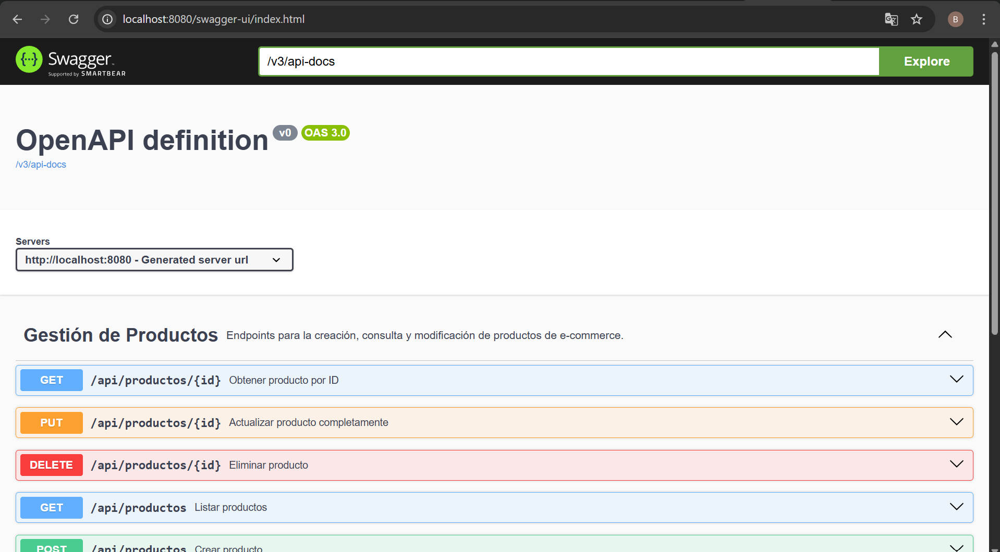
    Consola H2 (Verificación de Datos): http://localhost:8080/h2-console
    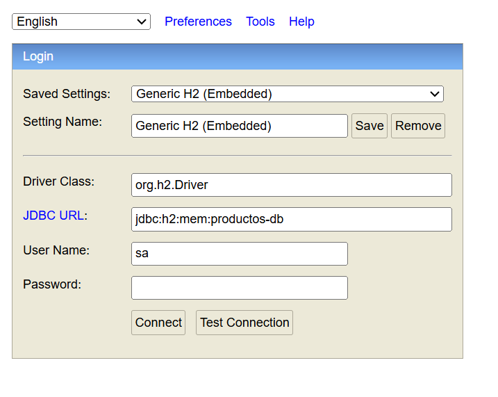

## **🗺️ Tabla de Endpoints REST**
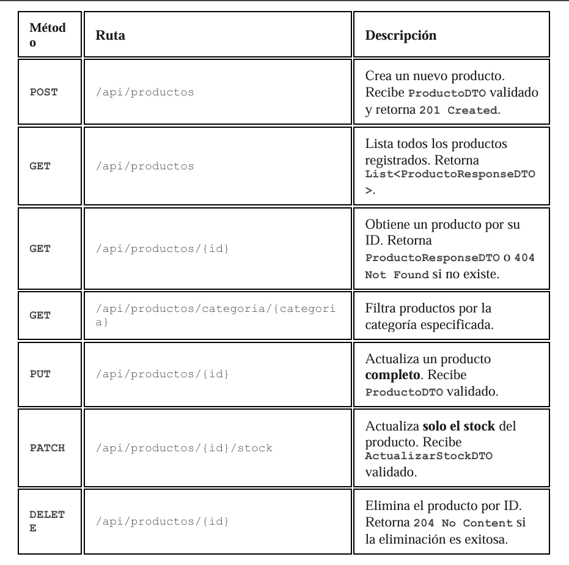

## **📸 Capturas de Pantalla (Parte 7)**
1. Prueba exitosa de Creación 
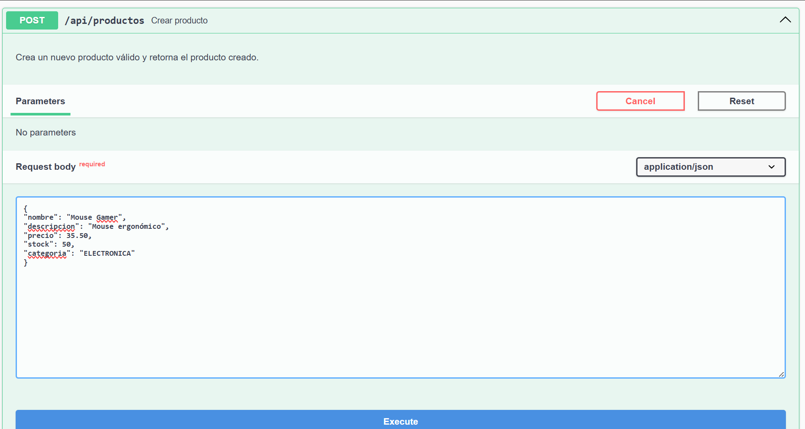
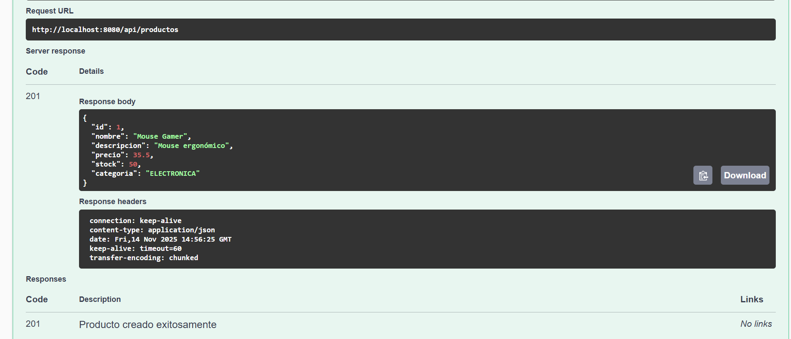
2. Listado de productos
   Se muestra el resultado del endpoint GET /api/productos, retornando todos los productos almacenados en la base de datos H2.
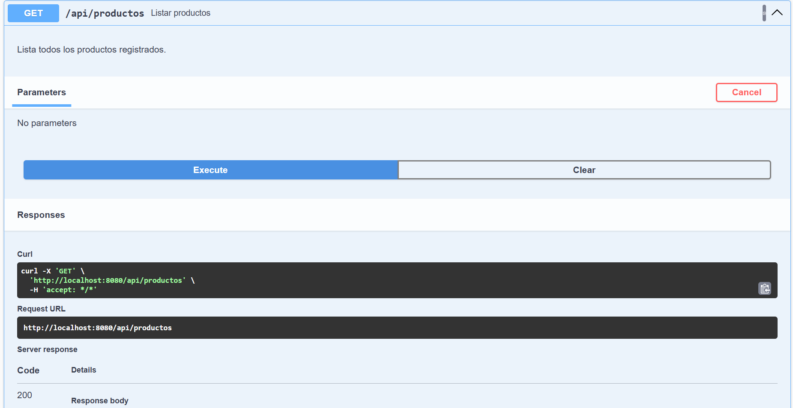
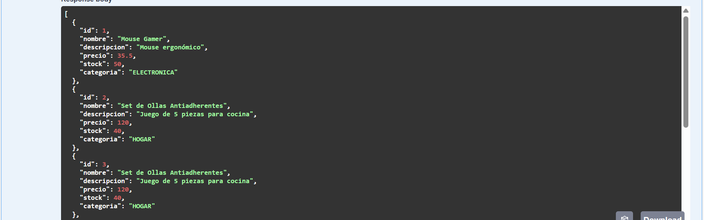
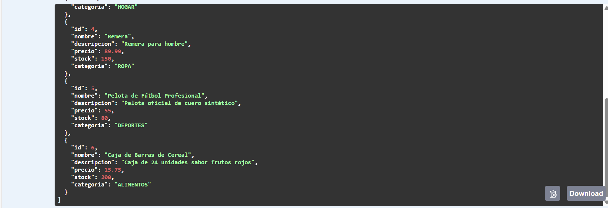
3. Obtención de un producto con id inexistente (error 404)

4. Actualización de producto :
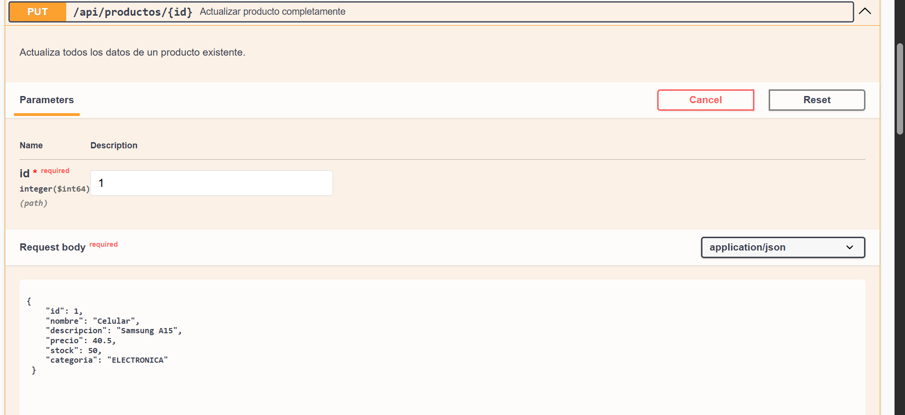
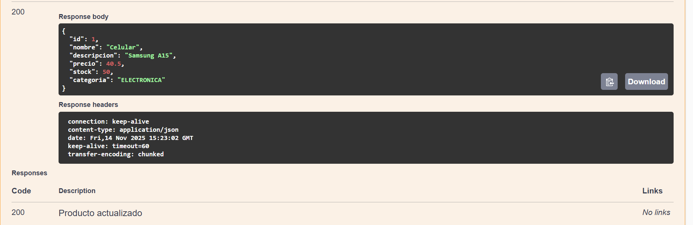

_Actualización de Stock_
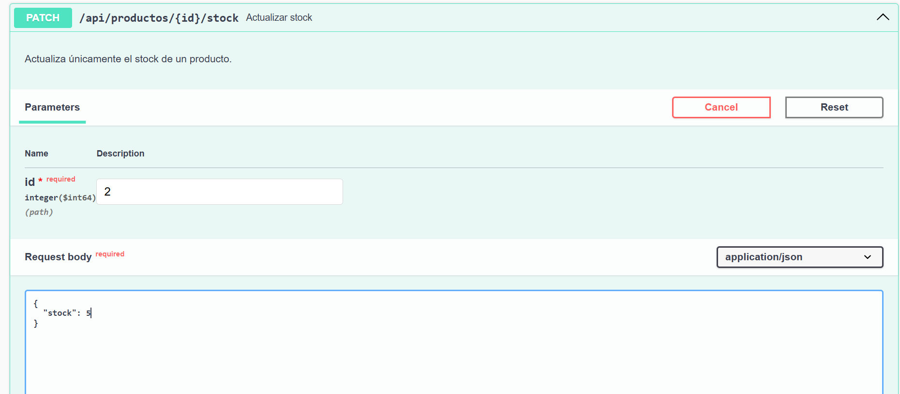
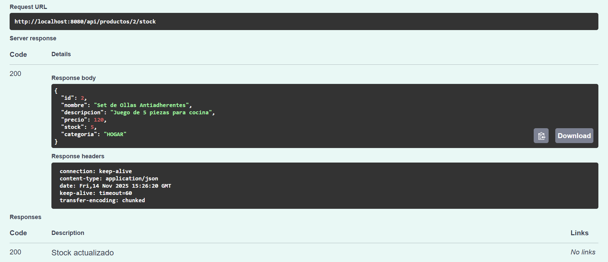

5. Eliminación de producto
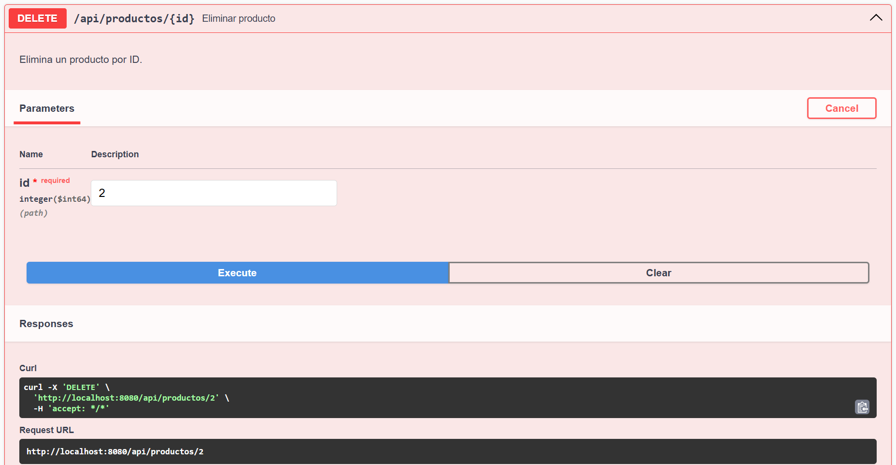
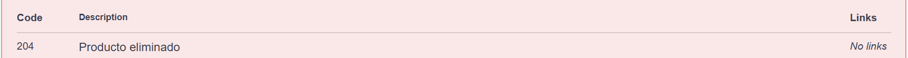

_Intentar obtener nuevamente el producto eliminado (error 404)_

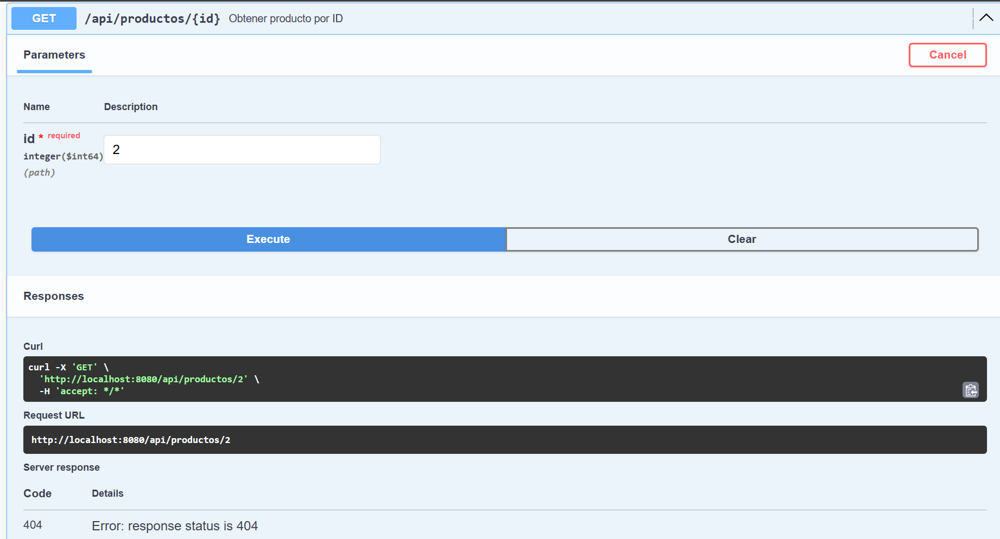

6. Verificación en H2 - datos persistidos
Obtención de la tabla de productos:
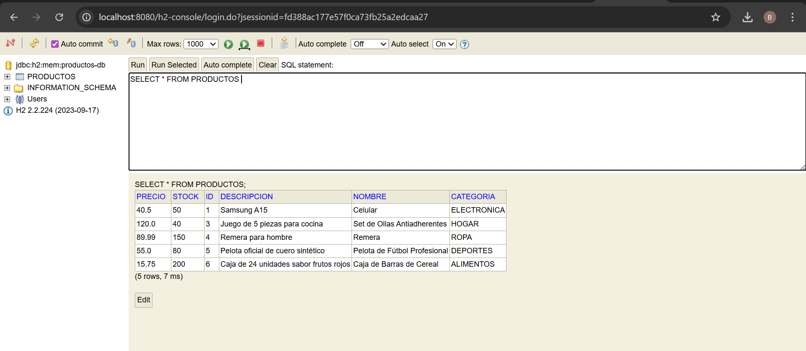

☑️ Conclusiones Personales
Durante el desarrollo de este trabajo práctico pude comprender de manera más profunda cómo se estructura y funciona una API REST con Spring Boot. No solo aprendí a implementar operaciones CRUD, 
sino también la importancia de separar responsabilidades utilizando DTOs, aplicar validaciones adecuadas y manejar errores de forma centralizada para ofrecer respuestas claras al cliente. 
Además, integrar Swagger fue fundamental para visualizar y documentar todo el funcionamiento de la API de forma más profesional.

El proceso me permitió reforzar buenas prácticas de arquitectura, mejorar mi comprensión del ciclo de datos desde el controlador hasta la capa de persistencia y 
familiarizarme con herramientas reales usadas en la industria. En general, siento que este trabajo me ayudó a afianzar conceptos esenciales y ganar más confianza trabajando con Spring Boot.